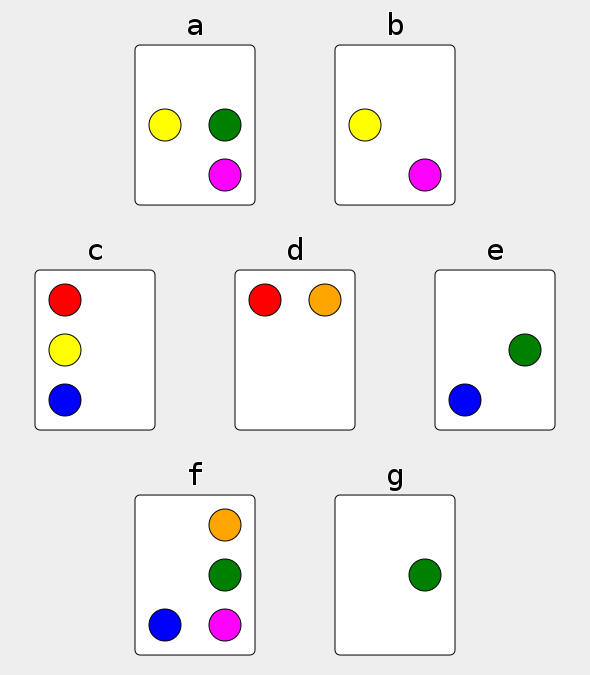

# Chill Touchscreen Games
## Making Embedded Systems, Orange Stars Cohort, June 2022

As a hardware person, I'd love to build a final project that pulls in a pile of external sensors and actuators and custom PCBs. However, owing to the chaos of moving, I've identified two things:

  1. I won't have consistent access to the external devices that I want
  2. Something simple and chill sounds really appealing right now, my goodness

So the objective became to make some small serotonin-boosting games using just the STM32F429I-DISC1 and a laptop.

Open concerns:
  1. I have not yet worked with the gyro and don't know how hard it will be to implement a viable tilt-detection.
  2. I don't know how I will do a file system and "retrieve image over USB" function.
  3. For demonstration purposes, would it be better to combine these two projects as a single project, and have the user switch between them with, say, a long button press or a different gyro motion? From a hardware perspective they aren't that different.
  4. Other than the aforementioned gyro and file system, I don't foresee having to change any more parts of the toolchain or fuss with STM32CubeIDE settings. Just a lot of practicing C, which will be good for me. But maybe dealing with more toolchains or makefiles or settings would be good, since that seems to be a significant chunk of embedded-systems work.
  5. Actually, should I use C or C++? I think I can live without classes but they could come in handy. I don't have the experience to know what (if anything) justifies using one versus the other.

# Chill Game 1: Projective Set

## Rules of the game

[Projective Set](https://en.wikipedia.org/wiki/Projective_Set_(game)) is a card game about finding sets. Seven cards are dealt out, each with some number of different-color dots:

A "set" is any number of cards such that there is an even number of each color dot. For example, in the above screenshot, A-B-G form a set, as they combine to have 2 yellow, 2 green, 2 magenta, 0 red, 0 orange, and 0 blue dots. B-C-D-F-G also forms a set, because there are 2 of each color (but a set could have 4 or 6 of some colors, too!). Another set exists in this picture, but is left as an exercise for the reader (I don't think I've ever has the chance to say that before!).

A more engaging way to approach set-finding is to visualize two cards combining, and erasing any dots that are shared between them. So, taken together, card A and card B can be thought of as a single card with one green dot; they each have a yellow and a magenta dot, so those cancel out. This combo can then be combined with card G; no dots remain, meaning A-B-G are a set.

In a more computery sense, each card holds a 6-bit value, where a dot indicates a 1 if present and a 0 if absent. So we could say card A has value `0b001101`, card B has value `0b001001`, card C is `0b101010`, and so on. Then, a set is a group of values that bitwise XORs to 0. Using A-B-G again: `0b001101 ^ 0b001001 ^ 0b000100 == 0b000000`.

It makes more sense once you've played the game a bit, [here is a web-based version](https://www.settinger.net/projects/proset/prosetJS/).

## Proset for the STM32F429I-DISC1

The board's LCD touchscreen is the primary display and interaction focus. Touching cards on the screen selects or deselects them. When a set is found, the cards are replaced with new cards until the deck is depleted. Shaking the board resets the game. Pressing the user-input button opens a settings menu where the difficulty level can be changed and colorblindness optimization can be enabled. A console interface lets the player use keyboard inputs instead of the touchscreen.

*\[In the final report, diagrams representing the system will go here. The hardware block diagram will have the LCD-touchscreen and gyro communicate with the processor via SPI, a terminal comunicating with the processor via UART, a button communicating via GPIO, and possible a speaker also via GPIO. The software block diagram will describe have blocks for: gyro HAL, gyro tilt detection, LCD-touchscreen HAL, drawing to display, reading touch inputs, reading to/writing from console, EEPROM emulation, settings store/recall, button control, possibly speaker control.\]*

# Chill game 2: Portuguese Tile Painting

*Azulejo* refers to a Portuguese style of painted ceramic tilework. Painted tiles are often used to decorate building exteriors, typically with a pattern with symmetry across multiple axes.

<small><i>Detail from a photo by <a href="https://unsplash.com/@jeancarloemer?utm_source=unsplash&utm_medium=referral&utm_content=creditCopyText">Jean Carlo Emer</a> on <a href="https://unsplash.com/?utm_source=unsplash&utm_medium=referral&utm_content=creditCopyText">Unsplash</a></i></small>

## Azulejos on the STM32F429I-DISC1

A paint program was implemented on the STM32F429I-DISC1 touchscreen. One stroke results in eight lines being drawn on the screen, preserving 4-fold radial and bilateral symmetry. The stroke width and color can be adjusted by pressing the user-input button, which opens a settings menu. Also on the settings menu, the user can generate a random "starter" azulejo design, because sometimes staring at a blank canvas is too daunting. The settings menu also includes a "Save & Transmit" option that saves the current drawing as a bitmap on the device's file system, which the user can retrive when the device is connected to a computer by USB.

*a mockup in javascript*

*\[In the final report, diagrams representing the system will go here. The hardware block diagram will have the LCD-touchscreen communicate with the processor via SPI, a terminal comunicating with the processor via UART, a button communicating via GPIO, and a file system thing via either USB or JTAG I don't fully understand yet. The software block diagram will describe have blocks for: graphics processing, LCD-touchscreen HAL, drawing to display, reading touch inputs, reading to/writing from console, settings store/recall, file system, button control.\]*
